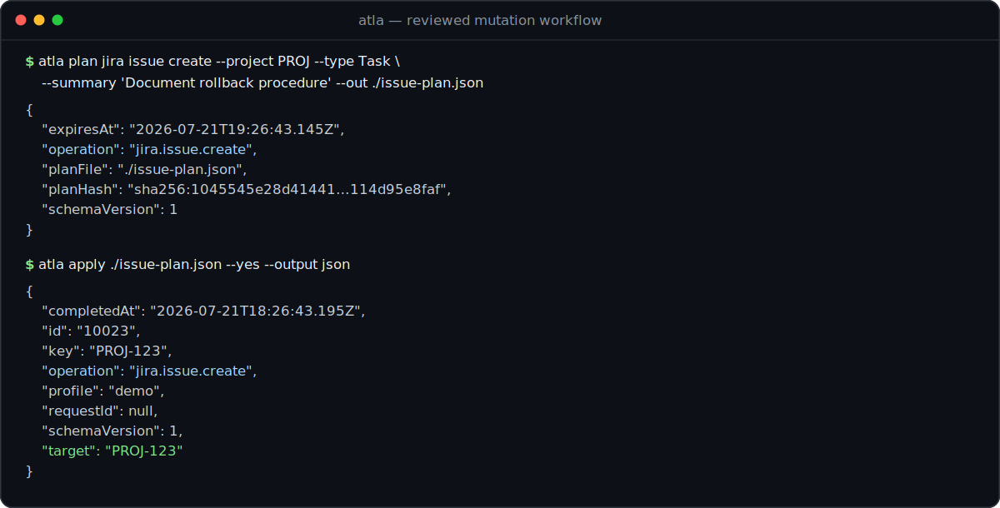

# atla

**Jira and Confluence, one agent-ready CLI.**

Work across Atlassian Cloud with bounded reads, versioned JSON, and mutations that move from
preview to reviewed plan to explicit apply—without changing tools.

[](https://github.com/NeoHsu/atla/actions/workflows/ci.yml)
[](https://github.com/NeoHsu/atla/releases/latest)
[](LICENSE)

<p align="center">
  
</p>
<p align="center"><sub>Sanitized capture of actual atla 0.6.0 output against a local mock API; no Atlassian tenant data.</sub></p>

## 30-second demo

Once authenticated, check for related work, preview a mutation without sending it, save the same
request as an expiring plan, and apply it only after review:

```bash
# Bound both the remote work and the JSON returned to a caller.
atla --read-only --max-items 5 --output json \
  jira search 'project = PROJ AND summary ~ "rollback" ORDER BY updated DESC'

# Emit a structured preview. No request is sent.
atla --dry-run --output json jira issue create \
  --project PROJ --type Task --summary 'Document rollback procedure'

# Persist a tamper-evident plan. This still sends no request.
atla plan jira issue create \
  --project PROJ --type Task --summary 'Document rollback procedure' \
  --out ./issue-plan.json
jq '{operation, planHash, expiresAt}' ./issue-plan.json

# Apply only after review and receive a versioned JSON receipt.
atla apply ./issue-plan.json --yes --output json
```

The final JSON object identifies the operation, profile, target, request ID when available, and
completion time. The same safety model covers supported Jira issue, Confluence page, and
Confluence blog plans.

## Why atla?

Jira and Confluence workflows rarely stay in one product. A task may begin with an issue, depend
on a Confluence runbook, and end in an automated update. Splitting that workflow across tools means
duplicating authentication, output parsing, safety rules, and agent instructions.

`atla` gives both products one profile and policy model. Humans get readable tables; scripts and
agents get versioned JSON, resumable pagination, and explicit context budgets. Mutations can be
previewed, saved as expiring tamper-evident plans, policy-checked, and applied only with explicit
confirmation.

## Core capabilities

- **One binary for Jira and Confluence** — shared profiles, authentication, routing, and policy.
- **Stable machine output** — versioned JSON schemas plus table, CSV, and `keys` output.
- **Safe mutations** — dry-run previews, saved plans for supported operations, explicit
  confirmation, and receipts.
- **Bounded agent context** — page, item, byte, and timeout budgets with resumable pagination.
- **Automation without hanging** — prompts appear only on TTYs and can be disabled with
  `--no-input`.
- **Content-aware Confluence workflows** — Markdown/ADF conversion and bounded body projection.
- **Version-matched agent skill** — current commands, JQL/CQL patterns, and safety rules for coding
  agents.

See the [full feature matrix](docs/features.md) for the complete Jira, Confluence, output, and
policy surface.

## Install

Verified installer for macOS and Linux:

```bash
base=https://github.com/NeoHsu/atla/releases/latest/download
curl --proto '=https' --tlsv1.2 -LsSfO "$base/atla-installer.sh"
curl --proto '=https' --tlsv1.2 -LsSfO "$base/atla-installer.sh.sha256"
shasum -a 256 -c atla-installer.sh.sha256
sh atla-installer.sh
```

With mise:

```bash
mise use -g github:NeoHsu/atla
```

From source:

```bash
cargo install --locked --git https://github.com/NeoHsu/atla --tag v0.6.0 atla
```

For the verified Windows installer, direct downloads, and platform-specific instructions, see
[Getting Started](docs/getting-started.md). Releases include checksum sidecars, build-provenance
attestations, and a CycloneDX 1.5 binary SBOM.

## Authenticate

Tokens are read from stdin and stored in the OS keyring by default:

```bash
printf '%s\n' "$ATLASSIAN_TOKEN" | atla auth login --no-input \
  --instance https://example.atlassian.net \
  --email you@example.com \
  --token-stdin
atla doctor --output json
```

Named profiles support multiple sites, scoped Atlassian tokens, file-backed credentials for
headless environments, and per-operation allow/deny policy. See
[Authentication](docs/authentication.md) and [Configuration](docs/configuration.md).

## Agent integration

Install the `atla-cli` skill from the release tag that exactly matches the CLI:

```bash
npx skills add https://github.com/NeoHsu/atla/tree/v0.6.0 --skill atla-cli
atla doctor --skill-version 0.6.0 --output json
```

The skill fails closed on version mismatch and provides an explicit tagged update command; it does
not update itself without confirmation. See the [Agent Reference](docs/agent-reference.md) for the
machine-oriented command contract.

## Documentation

- [Getting Started](docs/getting-started.md) — installation, authentication, and first commands
- [Feature Matrix](docs/features.md) — complete supported resource and command overview
- [Jira](docs/jira.md) and [Confluence](docs/confluence.md) — product command references
- [Output Formats](docs/output-formats.md) and [JSON Contracts](docs/json-schemas.md) — scripting
  and schema guarantees
- [Saved Plans](docs/plans.md) and [Operation Policy](docs/policy.md) — mutation and automation
  safety
- [Documentation Hub](docs/README.md) — all user, agent, and maintainer documentation

## Development

```bash
mise trust
mise install
mise run check:pr
```

See [CONTRIBUTING.md](CONTRIBUTING.md) for development checks and PR requirements. API client
maintenance is documented in [Code Generation](docs/code-generation.md), and release hardening in
[Release Procedure](docs/releasing.md).

## License

[MIT](LICENSE)
